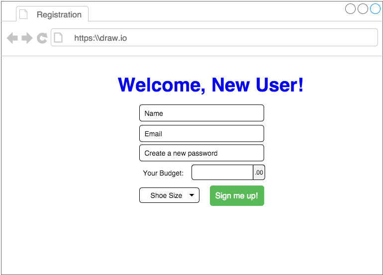

# Project #2: Happy Feet

## Overview

**Happy Feet** is a sneaker web application allowing users to create and budget an inventory of the hottest sneakers around. 

---

### Visit the App 

[happyFeet App](https://thawing-forest-14049.herokuapp.com)

---

## User Story:

* Create a database and ERD with the following tables:
    * **Users** - stores user `name`, `shoe_size` & `balance`
    * **Brand** - stores brand `name` & `headquarters`
    * **Sneakers** - stores sneaker `name`, `brand_id`, `retail_price`, `resale_price`, a brief `description` & `img_url`
    * **Inventory** - joins Sneakers & Users tables storing `user_id` & `sneaker_id`
    * *ERD Diagram can be found in the **Screenshots Section** below*

* Create the following views:
    * **login** - first page a user sees. displays login form for all visitors
    * **new_user** - displays user registration for all new users 
    * **user_home** - user's homepage displaying inventory of their sneakers
    * **search_results** - displays all sneakers queried from user's search
    * **sneaker** - displays profile of a sneaker
    * **sneaker_form** - displays sneaker form allowing user to add | edit a sneaker
    * ~~**error** - displays error message and redirects user to New User page if user's email is not in the database~~

* List of buttons:
    * **Log In** - authenicates & pulls appropriate user information
    * **Log Out** - terminates user's session
    * **Create New User** - displays user registration form to create a new user 
    * **Add Sneaker** - displays sneaker form to create & add a new sneaker 
    * **Edit Sneaker** - edits current sneaker information
    * **Delete Sneaker** - removes current sneaker from database

---

## RESTful Routes

### Resource: `/users`
table chart of routes for `/users`

||Friendly Name| Method | Route Name | What will Happen? | 
|---|---|:---:|:---:|---|
|1| Show Login form | GET  | `/` | `users/login` | 
|2| Verify User login | POST | `/login` | call `db.loginUser`, redirect to `/sneakers/:id` |
|3| Show New User form | GET | `/new` | `users/new_user` |
|4| Create New User | POST | `/` | call `db.createUser`, redirect to `/` login page |
|6| Logout | DELETE | `/logout` | redirect back to `/` login page |
|7| Invalid Login page | n/a | `/login` | `./users/error` called from `db.loginUser` |

#
### Resource: `/sneakers`
table chart of routes for `/sneakers`

||Friendly Name| Method | Route Name | What will Happen? | 
|---|---|:---:|:---:|---|
|1| User home page & list all Sneakers | GET | `/` | call `db.allSneakers`, render to `pages/user_home` | 
|2| Show Add Sneaker form | GET | `/new` | render `pages/sneaker_form`, route to `/sneakers/new` |
|3| Add a New Sneaker | POST | `/new` | call `db.addSneaker`, redirect to `/sneakers/` |
|4| List Search Results | GET | `/search` | call `db.searchSneaker`, render to `pages/search_results` |
|5| Show Edit Sneaker form | GET | `/:id/edit` | render `pages/sneaker_form`, route to `/sneakers/:id` |
|6| Show Sneaker Profile | GET | `/:id` | call `db.getSneaker`, render to `pages/sneaker` |
|7| Add Sneaker(to User) | POST | `/:id` | call `db.addInventory`, redirect to `/sneakers/` |
|8| Edit Sneaker | PUT | `/:id` | call `db.editSneaker`, redirect to `/sneakers/` |
|9| Delete Sneaker | DELETE | `/:id` | call `db.removeSneaker`, redirect to `/sneakers/` |

---

## PG Module Functions
table chart of SQL queries using PG module

|| Function Name | What it does | and... | Redirect / Render to... | 
|---|:---:|:---:|:---:|:---:|
|1| loginUser | authenticates user email & password || `/sneakers/` | 
|2| createUser | encrypts password, inserts to `members` table | inserts to `users` table | `/users/` |
|3| allSneakers | selects all `user_id` sneakers || `pages/user_home.ejs` |
|4| getSneaker | selects `sneaker_id` info || `pages/sneaker.ejs` |
|5| addSneaker | inserts to `sneakers` table | inserts to `inventory` table | `/sneakers/` |
|6| editSneaker | updates `sneaker_id` in `sneakers` table || `/sneakers/` |
|7| removeSneaker | deletes `sneaker_id` & `user_id` from `inventory` table || `/sneakers/` |
|8| searchSneaker | selects from `sneakers` table that contain the search word(s) || `pages/search_results.ejs` |
|9| addInventory | adds `sneaker_id` & `user_id` to `inventory` table || `/sneakers/` |

--- 

## Screenshots *( update! )*

#### ERD Diagram: 
 
#
#### Login page:
 
#
#### New User Registration page:
 
#
#### User Home page:
 
#
#### Search Results page:
 
#
#### Sneaker Profile page:
 
#
#### Sneaker Form page:
 
#
#### Error page:
 
#

---

## Project Requirements:
* **Have at _least_ 2 models:** 
    * ~~users~~
    * ~~sneakers~~ ( except searchSneakers )
* ~~**Include sign up/log in functionality**, with encrypted passwords & an authorization flow. (Using Bcrypt)~~
* ~~**Have complete RESTful routes:** ~~
    * ~~GET~~
    * ~~POST~~
    * ~~PUT~~
    * ~~DELETE~~
* ~~**Write full SQL queries using PG module or PG-promise module**~~ ( need to finish searchSneaker function )
* ~~**Include wireframes** that you designed during the planning process~~
* ~~**Include & Update User Stories**~~
* ~~**Include ERDs**~~
* ~~Have **semantically clean HTML and CSS**~~ *(duh, always)*
* **Be deployed online** and accessible to the public

---

### Programs & Softwares Used:

* ** HTML **
* ** CSS **
* ** JavaScript **
* ** Express.js **
* ** Node.js **
* ** PostgreSQL **
* ** BootStrap | Semantic-UI **
* ** Heroku **
